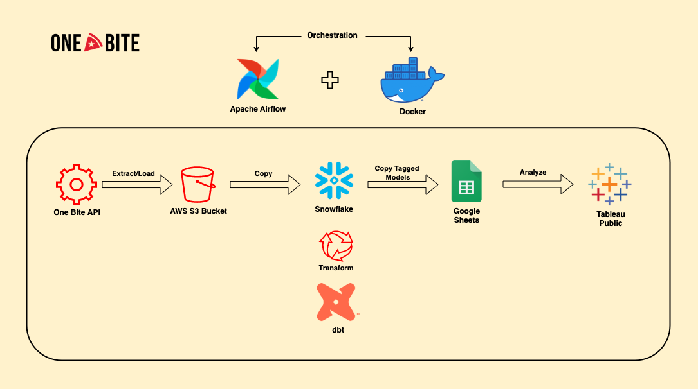
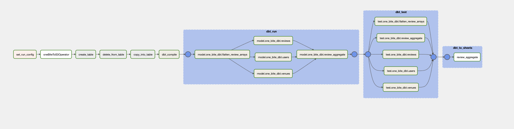

# One Bite Data Pipeline

An end-to-end data application to analyze pizza reviews.

## Overview
https://onebite.app is a mobile application created by Barstool Sports, a leading sports and pop culture media company. The mobile application allows users to review pizza restaurants in their area and give a short description of their experience along with an overall score.

In this project, the review data is collected via the One Bite REST API and staged in an Amazon S3 bucket. The data is then copied from the S3 bucket into Snowflake where it is transformed using dbt. The transformed models that are tagged in the dbt project are copied to a Google Sheet where Tableau Public can connect and display the data for free. This entire ELT workflow is orchestrated by Apache Airflow running locally in Docker containers.

## Motivation
The motivation for this project is primarily to gain experience using Apache Airflow, DBT & Snowflake. A secondary goal of the project is to showcase SQL and Tableau proficiency. 

## Architecture

## Airflow DAG
The Airflow DAG (Directed Acyclic Graph) below:

- `set_run_config`: Tells the DAG run if it is backfilling data or performing an incremental load. This produces two dates run_start and run_end that are used in downstream tasks.

- `oneBiteToS3Operator`: A custom operator that extracts data for rewiews that occur between the run_start and run_end from the One Bite website by looping through the review webpages.

- `create_table`: Executes a SQL script in Snowflake that creates a table to copy from an S3 stage into if it doesn't already exist.

- `delete_from_table`: Executes a SQL script in Snowflake that deletes from the table previously created between the run_start and run_end.

- `copy_into_table`: Executes a SQL script to copy data from the S3 stage into Snowflake.

- `dbt_compile`: Executes a dbt compile command to generate a fresh manifest.json file.

- `dbt_run`: Parses the dbt manifest and creates an Airflow task group that runs all dbt models.

- `dbt_test`: Parses the dbt manifest and creates an Airflow task group that tests all dbt models.

- `dbt_to_sheets`s: Parses the dbt manifest, finds all models tagged with "sheets" and copies the model outputs to a google sheet using the custom SnowflakeToSheetsOperator. This google sheet acts as the serving layer for Tableau Public.

### Project Directory

    .
    ├── dags                    # Dag files and modules used in dag
    ├── include                 # Additional SQL files used in dag
    ├── one_bite_dbt            # Dbt project directory
    ├── plugins                 
    ├── .gitignore              
    ├── docker-compose.yaml     # Container configuration file
    ├── Dockerfile              # File that builds the docker image
    ├── pipeline.png            # Architecture diagram created with draw.io
    ├── requirements.txt        # File containing dependencies for project
    └── README.md
