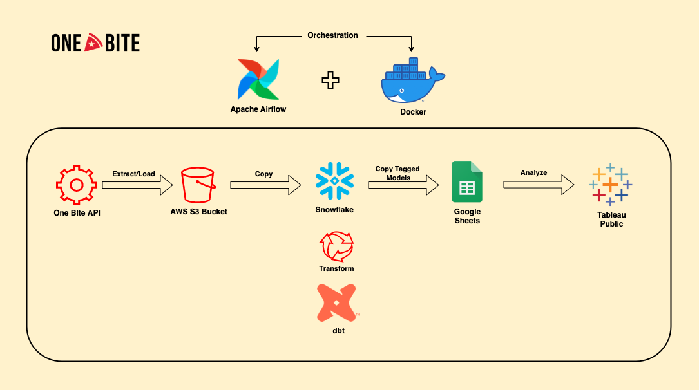
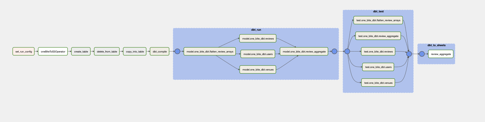
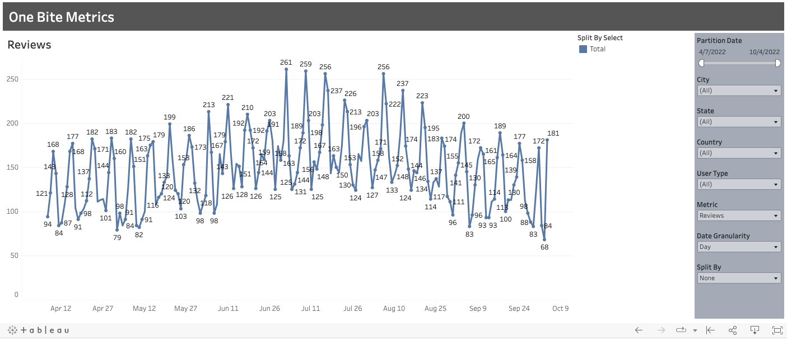

# One Bite Data Pipeline

An end-to-end data application to analyze pizza reviews.

## Overview

https://onebite.app is a mobile application created by Barstool Sports, a leading sports and pop culture media company. The mobile application allows users to review pizza restaurants in their area and give a short description of their experience along with an overall score.

In this project, the review data is collected via the One Bite REST API and staged in an Amazon S3 bucket. The data is then copied from the S3 bucket into Snowflake where it is transformed using dbt. The dbt models that are tagged with "sheets" in the dbt project are copied to a Google Sheet where my [Tableau Public](https://public.tableau.com/app/profile/alec7813/viz/OneBiteMetrics/OneBiteMetrics) dashboard can connect and display the data for free. The pipeline is orchestrated by Apache Airflow running locally in Docker containers.

## Motivation

The motivation for this project is primarily to gain experience using Apache Airflow, DBT & Snowflake. A secondary goal of the project is to showcase SQL and Tableau proficiency. 

## Architecture

## Airflow Overview

[Apache Airflow](https://airflow.apache.org/) is an open-source platform for developing, scheduling, and monitoring batch-oriented workflow. A DAG (Directed Acyclic Graph) is the core concept of Airflow, collecting Tasks together, organized with dependencies and relationships to say how they should run. A Task is the basic unit of execution in Airflow. Tasks are arranged into DAGs, and then have upstream and downstream dependencies set between them into order to express the order they should run in. A TaskGroup can be used to organize tasks into hierarchical groups in the Airflow graph view. 

## One Bite DAG

Below is the graph view of the One Bite DAG and each of the tasks that run as a part of the DAG: 

`set_run_config`: Tells the DAG run if it is backfilling data or performing an incremental load. This produces two dates run_start and run_end that are used in downstream tasks.

`oneBiteToS3Operator`: A custom operator that is used to download data from One Bite API and load that data to S3.

`create_table`: Executes a SQL script in Snowflake that creates a table to copy from an S3 stage into if it doesn't already exist.

`delete_from_table`: Executes a SQL script in Snowflake that deletes from the table previously created between the run_start and run_end.

`copy_into_table`: Executes a SQL script to copy data from the S3 stage into Snowflake.

`dbt_compile`: Executes a dbt compile command to generate a fresh manifest.json file.

`dbt_run`: Parses the dbt manifest and creates an Airflow task group that runs all dbt models.

`dbt_test`: Parses the dbt manifest and creates an Airflow task group that tests all dbt models.

`dbt_to_sheets`s: Parses the dbt manifest, finds all models tagged with "sheets" and copies the model outputs to a google sheet using the custom SnowflakeToSheetsOperator. This google sheet acts as the serving layer for Tableau Public.

## Tableau Dashboard 

The [Tableau Public](https://public.tableau.com/app/profile/alec7813/viz/OneBiteMetrics/OneBiteMetrics) dashboard is meant to be an operational dashboard that displays app usage over time. There are many filters that allow  users to drill-down into specifc dimensensions to glean insights. Also, there are some key parameters that can be used to dynamically change the view.

### Parameters
`Date Granularity`: Allows users to toggle between day, week & month to analyze trends with different granularity.

`Split By`: Allows users to split the trend line by any filter shown in the dashboard. This allows users to quickly slice-and-dice.

`Metric`: This toggles the metric displayed in the dashboard.

